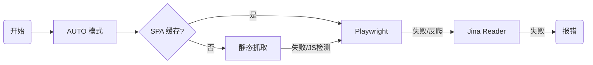

# Markitai 架构文档

> 写给未来的自己，也写给每一个想深入理解这个项目的人。
>
> *版本：v0.5.1 | 最后更新：2026-02-07*

---

## 概述

想象一下，你面对着一座由 PDF、Word 文档、PPT 幻灯片和网页链接组成的"信息孤岛"。你需要把它们变成结构化、可搜索、干净整洁的 Markdown 文本——可能是为了建立个人知识库，可能是为了喂给 RAG 系统，也可能只是为了让代码库的文档更漂亮。

**Markitai** 就是为此而生的工具。

但它不只是简单的格式转换。它能像一个经验丰富的编辑一样，帮你自动摘要、为图片添加说明、甚至理解复杂的排版布局。这就是 Markitai 的核心价值：**带有原生 LLM 增强支持的专业 Markdown 转换器**。

这不是一个简单的脚本集合，而是一个经过精心设计的工程系统。本文档描述了整体架构、模块依赖关系和关键设计决策，同时也记录了开发过程中踩过的坑和积累的工程经验。

---

## 系统架构

### 全景图

如果把 Markitai 比作一个工厂，它的流水线是这样的：

```mermaid
graph TD
    User[用户/CLI] --> CLI[CLI Layer (Click)]
    CLI --> Config[配置中心 (Pydantic)]
    CLI --> Workflow[Workflow 引擎]

    subgraph "核心处理区"
        Workflow --> Detect[格式检测]
        Detect --> Converter[转换器层]
        Converter --> PDF[PDF (PyMuPDF)]
        Converter --> Office[Office (Markitdown)]
        Converter --> URL[URL (Fetch Strategy)]
        Converter --> Image[Image (RapidOCR/CV2)]
    end

    subgraph "智能增强区 (LLM Layer)"
        Workflow --> LLM[LLM Processor]
        LLM --> Prompt[Prompt Manager]
        LLM --> Router[LiteLLM / Custom Router]
        Router --> Cache[两级缓存系统]
        Router --> Providers[OpenAI / Gemini / Claude Agent / Copilot]
    end

    Workflow --> Output[输出层]
```

### 六大核心子系统

Markitai 由六个相互协作的子系统组成，每个都各司其职：

#### 1. CLI 层 (`cli/`)
这是工厂的"控制台"。它不仅仅解析参数，还负责根据用户的预设（Preset）快速配置生产线。
- **亮点**：支持 `rich`、`standard`、`minimal` 预设，一键切换复杂的配置组合。

#### 2. Workflow 引擎 (`workflow/`)
这是"总指挥"。它不仅编排转换步骤，还通过 `ConversionContext` 对象在各步骤间传递状态，就像接力棒一样。
- **设计**：Pipeline 模式。验证 -> 转换 -> 图片处理 -> 基础写入 -> LLM 增强 -> 最终输出。

#### 3. Converter 层 (`converter/` & `fetch.py`)
这是"工人"。每种格式都有专门的转换器。
- **PDF**：使用 `pymupdf4llm` 进行高质量提取。
- **URL**：一个智能的策略链（Auto -> Static -> Browser -> Jina），能自动应对反爬和动态渲染。

#### 4. LLM 增强层 (`llm/`)
这是"大脑"。它不直接调用 API，而是通过一个复杂的路由系统。
- **亮点**：支持标准 API (OpenAI/Gemini) 和本地 CLI 工具 (Claude Agent/GitHub Copilot)，这在同类工具中非常少见。

#### 5. Prompt 管理系统 (`prompts/`)
这是"指令集"。
- **设计**：三层加载机制（配置 > 用户自定义 > 内置）。所有的魔法都藏在 `document_vision_system.md` 这样的模板里。

#### 6. OCR 与视觉层 (`ocr.py` & `image.py`)
这是"眼睛"。
- **OCR**：全局单例模式的 RapidOCR 引擎，带有预热机制，防止冷启动卡顿。
- **视觉**：OpenCV 和 Pillow 双引擎处理图片压缩，确保速度与质量的平衡。

---

## 模块依赖关系

```
cli/
├── main.py                    # 主 CLI 入口
│   ├── config.py              # 配置管理
│   ├── batch.py               # 批量处理
│   │   └── workflow/single.py
│   ├── workflow/single.py     # 单文件处理
│   │   ├── converter/*        # 格式转换器
│   │   ├── llm/processor.py   # LLM 增强
│   │   └── image.py           # 图像处理
│   └── fetch.py               # URL 抓取
└── commands/                  # 子命令组
    ├── config.py              # config 子命令
    ├── cache.py               # cache 子命令
    └── doctor.py              # doctor 诊断命令

llm/
├── __init__.py                # 包导出
├── processor.py               # LLMProcessor 类
├── types.py                   # 类型定义
├── cache.py                   # 缓存类
└── models.py                  # 模型工具函数

providers/
├── __init__.py                # 提供商注册
├── claude_agent.py            # Claude Code CLI 提供商
├── copilot.py                 # GitHub Copilot CLI 提供商
├── errors.py                  # 结构化错误类
├── auth.py                    # 认证管理器
├── timeout.py                 # 自适应超时计算
└── json_mode.py               # 统一 JSON 提取处理

workflow/
├── __init__.py                # 工作流导出
├── core.py                    # 核心转换逻辑
├── single.py                  # 单文件处理
└── helpers.py                 # 辅助函数

utils/
├── __init__.py                # 工具导出
├── cli_helpers.py             # CLI 工具函数
├── executor.py                # 线程池执行器
├── mime.py                    # MIME 类型检测
├── office.py                  # Office 软件检测
├── output.py                  # 输出路径解析
├── paths.py                   # 路径工具
├── progress.py                # 进度报告器
└── text.py                    # 文本处理工具
```

---

## 核心模块

### 1. CLI 层 (`cli/`)

**职责**: 命令行界面、参数解析、用户交互

**核心组件**:
- `main.py`: 使用 Click 框架的主入口
- `commands/config.py`: 配置管理命令
- `commands/cache.py`: 缓存管理命令

**设计决策**:
- 使用 Click 框架实现命令分组
- 支持文件、目录和 URL 三种输入类型
- 提供丰富的选项和预设配置

### 2. 配置系统 (`config.py`)

**职责**: 配置加载、验证、合并

**优先级顺序**:
```
1. CLI 参数（最高）
2. 环境变量
3. 配置文件（markitai.json）
4. 默认值（最低）
```

**核心类**:
- `MarkitaiConfig`: 根配置模型
- `LLMConfig`: LLM 相关设置
- `OutputConfig`: 输出设置
- `PromptsConfig`: Prompt 模板
- `FetchConfig`: URL 抓取设置
- `BatchConfig`: 批量处理设置
- `CacheConfig`: 缓存设置

**功能特性**:
- Pydantic v2 验证
- `env:VAR_NAME` 语法支持环境变量引用
- JSON Schema 自动生成
- ConfigManager 单例管理

### 3. 转换器层 (`converter/`)

**职责**: 将各种文件格式转换为 Markdown

**支持格式**:
| 转换器 | 格式 | 依赖 |
|--------|------|------|
| `pdf.py` | PDF | pymupdf4llm |
| `office.py` | PPTX, DOCX, XLSX | markitdown, python-pptx |
| `legacy.py` | DOC, XLS, PPT | LibreOffice 或 pywin32 |
| `image.py` | PNG, JPG, WebP | rapidocr, opencv |
| `text.py` | TXT, MD | - |

**设计模式**: 模板方法
```python
class BaseConverter(ABC):
    supported_formats: list[FileFormat] = []

    @abstractmethod
    def convert(
        self, input_path: Path, output_dir: Path | None = None
    ) -> ConvertResult:
        pass

    def can_convert(self, path: Path | str) -> bool:
        return detect_format(path) in self.supported_formats
```

**注册机制**:
```python
@register_converter(FileFormat.PDF)
class PdfConverter(BaseConverter):
    ...
```

### 4. LLM 集成 (`llm/`)

**职责**: LLM 调用、成本跟踪、缓存管理

**包结构**:
```
llm/
├── __init__.py      # 统一导出
├── processor.py     # LLMProcessor 类
├── types.py         # LLMResponse, ImageAnalysis, Frontmatter 等
├── cache.py         # SQLiteCache, PersistentCache, ContentCache
└── models.py        # 模型信息、成本计算、日志
```

**核心类**:
- `LLMProcessor`: 使用 LiteLLM Router 的主处理器
- `LLMRuntime`: 全局并发控制（信号量共享）
- `SQLiteCache`: 持久化 LRU 缓存（基于 SQLite）
- `PersistentCache`: 全局缓存包装器（支持模式跳过）
- `ContentCache`: 内存 TTL LRU 缓存

**类型定义** (`types.py`):
- `LLMResponse`: LLM 响应数据
- `ImageAnalysis`: 图像分析结果
- `Frontmatter`: 文档元数据
- `DocumentProcessResult`: 文档处理结果

**成本跟踪**:
- Token 计数（tiktoken / 字符估算）
- 成本计算（基于模型定价）
- 累计统计报告

### 5. 提供商系统 (`providers/`)

**职责**: 自定义 LLM 提供商集成

**架构设计**:
```python
# 使用 LiteLLM CustomLLM 接口
def register_providers() -> None:
    """注册所有自定义提供商到 LiteLLM"""
    litellm.custom_provider_map.append({
        "provider": "claude-agent",
        "custom_handler": ClaudeAgentProvider()
    })
```

**支持的提供商**:
- `claude-agent/*`: Claude Code CLI（订阅制，无额外 API 费用）
  - 别名: `sonnet`, `opus`, `haiku`, `inherit`
  - 动态版本解析：自动查找 LiteLLM 数据库中的最新版本
- `copilot/*`: GitHub Copilot CLI（订阅制）
  - 直接使用模型名: `gpt-4.1`, `claude-sonnet-4.5`, `gemini-2.5-pro` 等

**辅助函数**:
- `count_tokens()`: Token 计数（tiktoken 或估算）
- `calculate_copilot_cost()`: Copilot 成本估算
- `validate_local_provider_deps()`: 依赖检查
- `get_local_provider_model_info()`: 获取模型信息

**可靠性模块**:
- `errors.py`: 结构化错误类（`ProviderError`, `AuthenticationError`, `QuotaError`, `ProviderTimeoutError`, `SDKNotAvailableError`）
- `auth.py`: `AuthManager` 单例，缓存认证状态检查
- `timeout.py`: 基于请求复杂度的自适应超时计算
- `json_mode.py`: `StructuredOutputHandler` 统一 JSON 提取和验证

### 6. URL 抓取 (`fetch.py`)

**职责**: Web 内容获取

**策略模式**:
```
AUTO（默认）
├── STATIC: 静态 HTML（requests + BeautifulSoup）
├── PLAYWRIGHT: 动态渲染（Playwright）
└── JINA: Jina Reader API
```

**SPA 检测与缓存**:
- JavaScript 框架检测（React, Vue, Angular 等）
- 域名 SPA 标记持久化
- 智能策略选择

**配置选项**:
- `strategy`: 抓取策略（auto/static/playwright/jina）
- `fallback_patterns`: 回退策略的 URL 模式匹配
- `playwright`: Playwright 浏览器配置
- `jina`: Jina API 配置

### 7. 批量处理 (`batch.py`)

**职责**: 并发多文件处理

**功能特性**:
- 可配置并发数（默认 10）
- 断点续传支持（状态持久化）
- 实时进度显示（Rich Live）
- 错误隔离（单文件失败不影响整体）

**状态管理**:
- `FileState`: 文件处理状态
- `UrlState`: URL 处理状态
- `BatchState`: 批量任务状态
- 定期状态刷新（防止数据丢失）

**状态转换**:
```
PENDING -> IN_PROGRESS -> COMPLETED
                       -> FAILED
```

### 8. 工作流层 (`workflow/`)

**职责**: 统一的文档转换流程

**组件**:
- `core.py`: 核心转换逻辑和上下文
- `single.py`: 单文件处理流程
- `helpers.py`: 辅助函数（frontmatter 合并、LLM usage 统计等）

**ConversionContext 数据类**:
```python
@dataclass
class ConversionContext:
    input_path: Path
    output_dir: Path
    config: MarkitaiConfig
    shared_processor: LLMProcessor | None = None
    # ... 处理状态和跟踪字段
```

---

## 代码组织结构

### 为什么是 Monorepo？

我们选择了 Monorepo 结构，但这并不是为了赶时髦。

```
/home/y/dev/markitai/
├── packages/markitai/           # 主包（核心逻辑）
│   ├── src/markitai/
│   │   ├── cli/                # 命令行入口
│   │   ├── llm/                # 智能核心
│   │   ├── providers/          # 自定义 LLM 适配器
│   │   ├── workflow/           # 流程编排
│   │   ├── converter/          # 格式转换
│   │   └── prompts/            # 提示词模板
│   └── tests/                  # 测试套件
├── docs/                       # 文档
└── pyproject.toml              # 工作区配置
```

**决策原因**：
1.  **发布灵活性**：`packages/markitai` 可以作为独立的 PyPI 包发布。
2.  **工具链统一**：根目录的 `uv`、`ruff`、`pyright` 配置可以同时管理主包、文档站脚本和未来可能的插件。
3.  **关注点分离**：核心代码与文档、辅助脚本物理隔离，保持 `src` 目录的纯净。

### 测试架构：三道防线

为了保证代码质量，我们建立了三道防线：

1.  **单元测试 (`tests/unit/`)**：
    -   **职责**：测试单个函数或类。
    -   **策略**：大量使用 `unittest.mock` 模拟 LLM 和网络请求。这是第一道防线，运行速度极快。

2.  **集成测试 (`tests/integration/`)**：
    -   **职责**：测试完整的工作流。
    -   **资源**：`tests/fixtures/` 里存放了真实的 PDF、PPTX、DOCX 文件。我们会真的去跑一遍转换流程，确保各组件配合无误。

3.  **手动验证 (`tests/SKILL.md`)**：
    -   **职责**：针对 AI 行为的主观评估。
    -   **场景**：有些东西（如摘要写得好不好）是自动化测试测不出来的，我们需要人工或更高级的 AI 来根据指南进行验收。

---

## 数据流

### 单文件转换流程

一个 PDF 文件进入系统后，会经历一场精彩的接力赛：

1.  **检测 (Detection)**：`converter/base.py` 识别出这是 PDF。
2.  **提取 (Conversion)**：`PdfConverter` 上场，利用 PyMuPDF 提取文本和页面图片。
3.  **清洗 (Sanitization)**：`image.py` 处理提取出的图片，压缩、去重，生成 assets。
4.  **初稿 (Drafting)**：生成基础的 `.md` 文件。
5.  **增强 (Enhancement)**：
    -   如果开启了 `--llm`，`LLMProcessor` 接手。
    -   它可能会调用 Vision 模型看截图，或者调用文本模型做摘要。
    -   **关键点**：这里使用了 `instructor` 库的 `Mode.MD_JSON` 来保证 LLM 输出合法的 JSON。
6.  **完稿 (Finalization)**：将 LLM 的输出合并回 Markdown，生成最终的 `.llm.md`。

```
Input File
    |
    v
+---------------+
| Format Detect |
+-------+-------+
        |
        v
+---------------+
| Select        |
| Converter     |
+-------+-------+
        |
        v
+---------------+
| Convert       |
| Content       |
+-------+-------+
        |
        v
+---------------+     +---------------+
| LLM Enhance?  |---->| LLM Process   |
+-------+-------+     +-------+-------+
        |                     |
        v                     v
+----------------------------------+
|        Output Markdown           |
+----------------------------------+
```

### URL 抓取策略链

抓取网页比处理本地文件复杂得多。我们实现了一个**降级策略链 (Strategy Chain)**：



**有趣的细节**：
-   **SPA 学习机制**：如果你抓取 `x.com` 失败并发现需要 JS，系统会记住这个域名。下次你再抓取 `x.com` 的任何链接，系统会直接跳过静态抓取，直接启动浏览器，节省时间。

```
URL Input
    |
    v
+---------------+
| Strategy      |
| Selection     |
| (AUTO)        |
+-------+-------+
        |
        +---> STATIC ---> requests ---> HTML
        |
        +---> PLAYWRIGHT ---> Playwright ---> Rendered HTML
        |
        +---> JINA ---> Jina API ---> Markdown
        |
        v
+---------------+
| Content       |
| Extraction    |
+-------+-------+
        |
        v
+---------------+
| Markdown      |
| Conversion    |
+---------------+
```

### LLM 调用与路由

在 `llm/processor.py` 内部，有一个复杂的路由逻辑：

1.  **LocalProviderWrapper**：专门伺候 Claude Code CLI 和 GitHub Copilot CLI 这种本地工具。
2.  **LiteLLM Router**：处理 OpenAI、Gemini 等标准 API，自带负载均衡和重试。
3.  **HybridRouter**：把上面两者结合起来。你可以同时配置 `claude-agent/sonnet` 和 `openai/gpt-4o`，系统会自动分发。

---

## 关键设计决策

### 1. LiteLLM：不重复造轮子

**决策**: 使用 LiteLLM 作为 LLM 网关

**问题**：我们需要支持 OpenAI、Anthropic、Gemini、DeepSeek 等 100+ 模型。

**原因**:
- **统一接口**：`acompletion()` 一行代码搞定所有模型的调用。
- **成本追踪**：自带 `completion_cost()`，方便用户记账。
- **路由策略**：内置 `simple-shuffle` 和 `least-busy`，这对混合模型配置非常有用。
- 内置重试和错误处理
- Token 计数和路由负载均衡

### 2. Click vs Typer：成熟胜于现代

**决策**: 使用 Click 框架实现 CLI

**问题**：CLI 框架选谁？

**原因**：虽然 Typer 很酷（基于类型注解），但 Click 更成熟、更底层。我们需要一些动态添加选项的高级功能（Decorator Pattern），Click 处理得更优雅。而且 `rich-click` 的集成也更稳定。

### 3. Pydantic v2：配置即契约

**决策**: 使用 Pydantic v2 进行配置管理

**原因**:
- 运行时类型验证
- 自动生成 JSON Schema
- 环境变量集成
- 清晰的错误信息

**有趣的设计**：
-   **`env:` 语法**：用户可以在 JSON 配置文件里写 `"api_key": "env:MY_KEY"`，程序运行时自动去读环境变量。这避免了把密钥硬编码在配置文件里。
-   **最小差异保存**：当程序保存配置时，只会写入用户修改过的字段，而不是把几百个默认值都 dump 出来。这让配置文件保持清爽。

### 4. 为什么支持 Local Providers？

**决策**: 创建 LocalProviderWrapper 集成 Claude/Copilot CLI

这是一个非常独特的功能。大多数工具都要求你填 API Key。

**原因**:
1.  **省钱**：很多开发者已经买了 Copilot 订阅或 Claude 订阅，为什么要让他们再付 API 费用？利用现有订阅，无额外 API 费用。
2.  **隐私**：通过本地 CLI 走的是经过认证的安全通道。本地认证，无需管理 API 密钥。
3.  与 LiteLLM 生态系统无缝集成。

### 5. 策略模式处理 URL 抓取

**决策**: 实现 AUTO -> STATIC -> BROWSER -> JINA 策略链

**原因**:
- 不同站点需要不同策略
- 静态抓取速度快、成本低
- 浏览器渲染处理 SPA
- Jina API 作为后备方案

### 6. 模块重构的必要性

**决策**: 将 `llm.py` 和 `cli.py` 拆分为包

**原因**:
- 更好的代码组织（关注点分离）
- 提高可测试性
- 更易于维护和扩展
- 清晰的依赖边界

---

## 工程经验 (War Stories)

### PyMuPDF 的线程安全陷阱

**症状**：多线程 OCR 时程序随机崩溃。
**原因**：`fitz.Document` 不是线程安全的。你不能在 Thread A 打开它，然后在 Thread B 读取它。
**修复**：在每个线程里重新打开文档。虽然听起来效率低，但比崩溃强。

### LLM 的 "贴心" JSON 包裹

**症状**：我们要 JSON，LLM 给了 JSON，但它好心地加了 ` ```json ... ``` `。
**后果**：`json.loads()` 报错。
**修复**：使用 `instructor.Mode.MD_JSON`。这就像给 LLM 配了一个翻译官，专门负责剥掉这些 Markdown 外衣。

### 消失的占位符

**症状**：我们用 `<!-- Page 1 -->` 标记页码，但 LLM 觉得这行注释没用，直接删了。
**后果**：增强后的文档丢失了页码对应关系。
**修复**：
1.  **伪装**：把注释变成 `__MARKITAI_PAGENUM_1__` 这样看起来很重要的 token。
2.  **强加**：在 System Prompt 里严厉警告 "DO NOT DELETE TOKENS starting with __MARKITAI"。
3.  **兜底**：并在代码里写了 fallback，如果 token 真的丢了，尝试从原文恢复。

### OCR 引擎的冷启动

**症状**：处理第一张图片时卡顿 5-8 秒。
**原因**：RapidOCR 初始化 ONNX Runtime 非常慢。
**修复**：**单例模式 + 预热**。程序启动时在后台线程先跑一次 100x100 的空白图识别。等用户真的要处理图片时，引擎已经热身完毕了。

---

## 实现细节

### 代理侦探 (Proxy Detective)

Markitai 会像侦探一样寻找你的代理设置：
1.  先看环境变量 `HTTPS_PROXY`。
2.  再查 Windows 注册表或 macOS 的 `scutil`。
3.  最后甚至会去扫本地端口（7890, 10808...）。
这确保了在中国等网络受限环境下，开箱即用。

### 图像压缩双引擎

为了速度和兼容性，我们实现了双引擎：
-   **主引擎 (OpenCV)**：C++ 编写，速度极快，且释放 Python GIL，适合多线程。
-   **备用引擎 (Pillow)**：纯 Python 兼容性好，OpenCV 失败时自动顶上。

### 原子写入 (Atomic Writes)

如果不小心断电了，你的文件会损坏吗？
Markitai 使用原子写入策略：先把内容写入 `.tmp` 文件，确保存盘成功后，再执行 `os.replace()` 瞬间替换原文件。这保证了文件要么是旧的，要么是新的，绝不会是坏的。

---

## 扩展点

### 添加新的转换器

```python
# converter/new_format.py
from markitai.converter.base import BaseConverter, FileFormat, register_converter

@register_converter(FileFormat.NEW)
class NewFormatConverter(BaseConverter):
    supported_formats = [FileFormat.NEW]

    def convert(self, input_path: Path, output_dir: Path | None = None) -> ConvertResult:
        # 实现转换逻辑
        return ConvertResult(markdown=content)
```

### 添加新的 LLM 提供商

```python
# providers/new_provider.py
from litellm.llms.custom_llm import CustomLLM

class NewProvider(CustomLLM):
    def completion(self, model: str, messages: list, **kwargs):
        # 实现调用逻辑
        return ModelResponse(...)

# 在 providers/__init__.py 中注册
litellm.custom_provider_map.append({
    "provider": "new-provider",
    "custom_handler": NewProvider()
})
```

---

## 性能考量

### 并发控制

- 批量处理默认 10 个并发任务
- 通过配置可调整
- LLMRuntime 共享信号量控制 LLM 并发

### 缓存策略

- LLM 结果缓存（SQLite，基于内容哈希）
- SPA 域名缓存（持久化）
- HTTP 条件请求（ETag/Last-Modified）
- 模式匹配跳过缓存

### 内存管理

- 大文件流式处理
- 及时释放图像缓冲区
- 单文件大小限制（500MB）
- 线程池执行器（转换器隔离）

---

## 安全考量

- 路径遍历保护（`validate_path_within_base`）
- 符号链接检查（`check_symlink_safety`）
- 文件大小限制
- 原子文件写入（`atomic_write_text`, `atomic_write_json`）
- 敏感信息过滤
- Glob 模式转义（`escape_glob_pattern`）

---

## 待改进项

1.  **图片缓存持久化**：目前图片缓存只在内存里，重启程序后同样的图片要重新压缩一遍。未来应该存入 SQLite。
2.  **增量转换**：检测文件修改时间，如果源文件没变，直接跳过转换。
3.  **流式输出**：对于长文档，让用户能看到字符一个个蹦出来，体验会更好。

---

## 附录

### A. 常用常量速查

| 常量 | 值 | 说明 |
|------|----|------|
| `MAX_DOCUMENT_SIZE` | 500 MB | 单个文档大小上限 |
| `DEFAULT_LLM_CONCURRENCY` | 10 | LLM 并发请求数 |
| `DEFAULT_CACHE_TTL_SECONDS` | 300s | 内存缓存时间 (SQLite 是永久的) |
| `DEFAULT_FETCH_FALLBACK_PATTERNS` | x.com, twitter.com, instagram.com, facebook.com, linkedin.com, threads.net | 默认启用浏览器回退的 URL 模式 |

### B. 配置加载优先级

1.  **命令行参数** (`--api-key`)
2.  **环境变量** (`MARKITAI_API_KEY`)
3.  **配置文件** (`markitai.json`)
4.  **默认值**

---

## 相关文档

- [CLI 参考](../website/guide/cli.md)
- [配置指南](../website/guide/configuration.md)
- [快速入门](../website/guide/getting-started.md)
